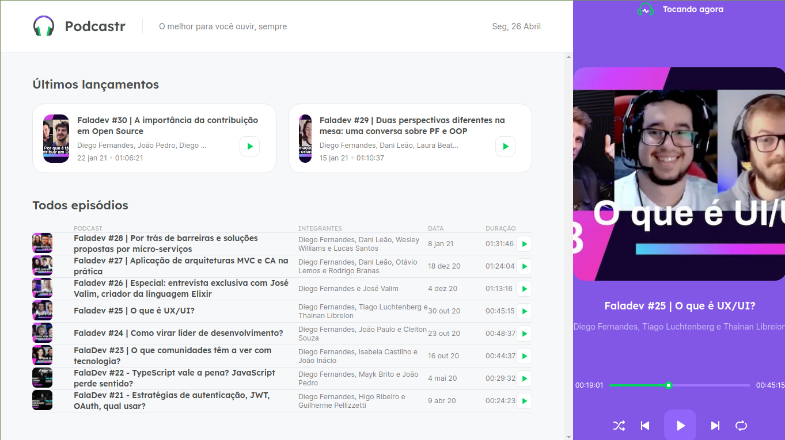

# Podecastr
## ReactJS 

Front-end de uma aplicação de podcast, chamado Podcastr.

Tecnologias:
- ReactJS
- NextJS
- Typescript
- Hooks
- State
- Sass
- consumo de API
- entre outras novas funcionalidade e conceitos do ReactJS

[LinkedIn](https://www.linkedin.com/in/bruno-bucard)